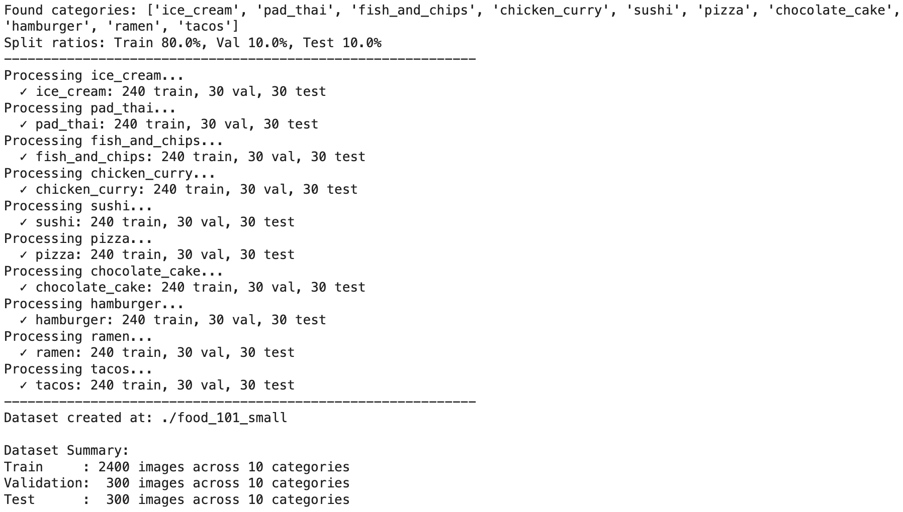
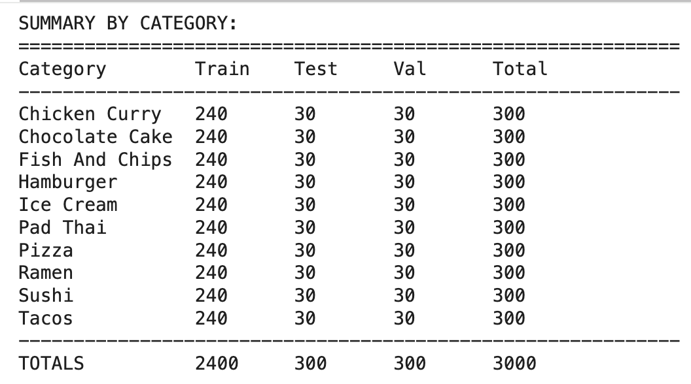
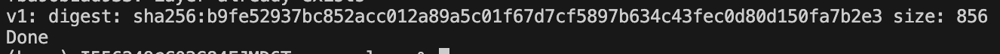
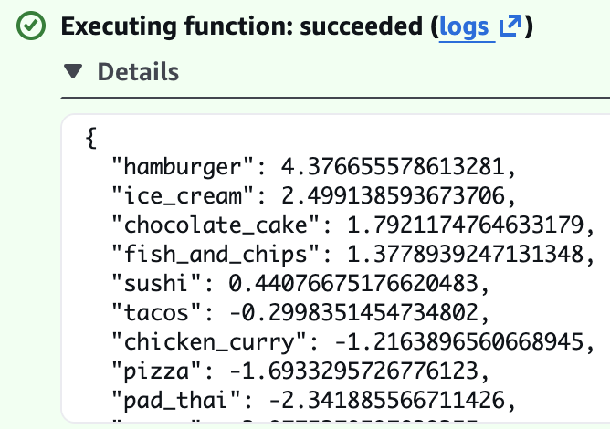

# 🍔 Machine Learning Project Food Image Classification

[Capstone project](https://github.com/DataTalksClub/machine-learning-zoomcamp/tree/master/projects) for DataTalks.Club Machine Learning ZoomCamp 2025. This is a second project I am working on for this course and hope you enjoy it!

## ⚠️ Problem Statement

In today's digital food culture, with the rise of food delivery apps, social media food sharing, and automated restaurant systems, the ability to accurately identify food items from images has become increasingly important. Whether you're a food blogger trying to automatically tag your content, a restaurant implementing automated order verification, or a health-conscious individual tracking dietary intake, manual food identification is time-consuming and prone to human error.

The biggest challenge facing food-related applications is the difficulty of accurate food recognition due to:
- **Visual similarity** between different food categories
- **Preparation variations** within the same food type
- **Lighting and angle differences** in real-world photos
- **Mixed dishes** containing multiple food items
- **Cultural variations** in food presentation

Traditional approaches rely on manual labeling or simple keyword tagging, but in today's AI-driven world, we can leverage deep learning for automated food recognition. Food images vary significantly in presentation, lighting, background, and preparation style, making accurate classification a complex computer vision challenge.

## 🎯 Goal

This project aims to build a food image classification system using the Food-101 dataset (10 categories subset) to automatically identify different food types from photographs with **Transfer Learning**. Transfer Learning is a machine learning technique where a pre-trained model (trained on a large dataset, which is [ImageNet](https://www.image-net.org/) with a total of over 14 million images in its training) is adapted for a new, related task. Instead of training a neural network from scratch, we leverage the knowledge already learned by models trained on massive datasets.


 By leveraging state-of-the-art deep learning models ([Xception](https://keras.io/api/applications/xception/), [MobileNet](https://keras.io/api/applications/mobilenet/), and [EfficientNetB0](https://keras.io/api/applications/efficientnet/#efficientnetb0-function)), we can provide reliable food recognition capabilities for various applications.

**Target Audience**:
- **Food delivery apps** seeking automated order verification systems
- **Health and fitness apps** requiring dietary tracking capabilities  
- **Restaurant technology** implementing automated food recognition for inventory or quality control
- **Food bloggers and social media** looking for automatic content tagging
- **Anyone interested** in computer vision and food classification applications

The ultimate goal is to build a robust image classification model that can accurately identify food categories from real-world photos, enabling automated food recognition in various practical applications.

## 🗄️ Initial Dataset

> [!CAUTION]
> **🚨 Data Processing Disclaimer**
> 
> **The initial 101,000-image dataset [found here](https://data.vision.ee.ethz.ch/cvl/food-101.tar.gz.) is NOT used directly for modeling.**
> 
> This project follows a systematic approach:
> 
> 1. **Data Preparation Phase:** ([EDA_Food.ipynb](https://github.com/eerga/CapstoneMLZoomcamp/blob/main/EDA_Food.ipynb)): Comprehensive analysis of the images, including image quality, size, and brightness, and rotation. The [initial dataset](https://data.vision.ee.ethz.ch/cvl/food-101.tar.gz.) has been converted to a smaller subset of the most popular foods that audience in the United States would choose for lunch or dinner options and consists of 10 food categories and 300 images per food category. The split into train, validation, and test folders is 80%, 10%, and 10%. The final data can be found in [Kaggle](https://www.kaggle.com/datasets/erika7/food-101-small-10-categories-trainvaltest-split/). The data is publically available. 
> 2. **Modeling Phase:** Three models were trained in total for this project: Xception, MobileNet, and EfficientNetB0. Each of the model training and testing phases are located in the respective Jupyter Notebooks (created with Google Colab): for Xception - ([Food_Xception.ipynb](https://github.com/eerga/CapstoneMLZoomcamp/blob/main/Food_Xception.ipynb)), for MobileNet - [Food_MobileNet.ipynb](https://github.com/eerga/CapstoneMLZoomcamp/blob/main/Food_MobileNet.ipynb), for ElasticNetB0 - [FoodElasticNetB0.ipynb](https://github.com/eerga/CapstoneMLZoomcamp/blob/main/Food_ElasticNetB0.ipynb). There was not a specific criteria for selecting models, more just curiousity to see how well each model performs under different circumstances. If you in the future would like to experiment with more models than what's presented here, please refer to [Keras documentation](https://keras.io/api/applications/). All of the models were able to classify the burger image as a burger, so we are going to use the lightest .onnx image. In our case, the model with the lightest image is EfficientNetB0. Advice for the future - use [Kaggle notebooks](https://www.kaggle.com/code) instead of Google Colab to not run into GPU resources limitations. 
> 3. **Final Model Training Phase:** 
There is no `train.py` or `train.ipynb` because the models built require GPU, so running a `train.py` just for the final model will be a pain, not to mention dependency nightmare. Instead, the final compressed model is hosted in [HuggingFace](https://huggingface.co/erikyshkin/food-classification-model/resolve/main/food_classifier_efficientnet_v6.onnx) and the model is used directly in the Dockerfile, so there is no need to download it. More details can be found in [🤖 Model Training](#-model-training). 
> 4. **Prediction Model Phase:** There is no `predict.ipynb` or `predict.py` code. Instead, the serverless prediction logic is handled by [`lambda_function.py`](https://github.com/eerga/CapstoneMLZoomcamp/blob/main/serverless/lambda_function.py) - the core AWS Lambda handler that processeses image URLs and returns food classification predictions. For local testing, there's a [`test.py`](https://github.com/eerga/CapstoneMLZoomcamp/blob/main/serverless/test.py) script that sends HTTP requests to your Docker container.
> 5. **Publishing Image to ECR** To publish a Docker image to AWS ECR, [`publish.sh`](https://github.com/eerga/CapstoneMLZoomcamp/blob/main/serverless/publish.sh) file is available. 
> 6. **Dependency Files:** [pyproject.toml](https://github.com/eerga/CapstoneMLZoomcamp/blob/main/serverless/pyproject.toml)
> 7. **Packaging the Code:** [Dockerfile](https://github.com/eerga/CapstoneMLZoomcamp/blob/main/serverless/Dockerfile) for running the service
> 8. **Local Docker Deployment**: See [🐳 Local Docker Deployment](#-local-docker-deployment) section below for local testing instructions
> 9. **Deployment**: See [☁️ AWS Serverless deployment](#️-aws-serverless-deployment) section with [video demonstration](https://www.youtube.com/watch?v=-sTecFyrV18)
> 
> Only the most relevant features that align with our problem statement will be selected for the final modeling process.
> 
> --------
> 
> **🔍 For the Detail-Oriented:** If you're curious about the nitty-gritty details of the data cleaning and preparation process, dive into [EDA_Food.ipynb](https://github.com/eerga/CapstoneMLZoomcamp/blob/main/EDA_Food.ipynb) for a comprehensive walkthrough.

### 🗄️ Initial Dataset Overview

**Dataset Source**: [Food-101 Original Dataset](https://data.vision.ee.ethz.ch/cvl/food-101.tar.gz)

**Dataset Structure**:
- **Total Images**: 101,000 images (1,000 per category)
- **Food Categories**: 101 different food types from around the world
- **Data Split**: No predefined split (requires manual splitting)
- **Image Format**: RGB color images (.jpg)
- **Input Size**: Varies (typically 512x512)

**Target Variable**: **🍽️ Food Category** - Multi-class classification with 101 food categories

**Food Categories Include**:
<details>
<summary><strong>🌍 Complete List of 101 Food Categories</strong> (Click to expand)</summary>

1. `apple_pie` - Traditional apple dessert
2. `baby_back_ribs` - Barbecue pork ribs
3. `baklava` - Middle Eastern pastry
4. `beef_carpaccio` - Thinly sliced raw beef
5. `beef_tartare` - Raw ground beef dish
6. `beet_salad` - Fresh beetroot salad
7. `beignets` - French pastry donuts
8. `bibimbap` - Korean mixed rice dish
9. `bread_pudding` - Sweet bread dessert
10. `breakfast_burrito` - Mexican-style wrap
11. `bruschetta` - Italian toasted bread
12. `caesar_salad` - Roman lettuce salad
13. `cannoli` - Italian pastry tubes
14. `caprese_salad` - Italian tomato mozzarella salad
15. `carrot_cake` - Spiced cake with carrots
16. `ceviche` - Latin American seafood dish
17. `cheese_plate` - Assorted cheese selection
18. `cheesecake` - Creamy dessert cake
19. `chicken_curry` - Spiced chicken dish
20. `chicken_quesadilla` - Mexican grilled tortilla
21. `chicken_wings` - Buffalo wings and variations
22. `chocolate_cake` - Rich chocolate dessert
23. `chocolate_mousse` - Light chocolate dessert
24. `churros` - Spanish fried pastry
25. `clam_chowder` - Creamy seafood soup
26. `club_sandwich` - Multi-layer sandwich
27. `crab_cakes` - Seasoned crab patties
28. `creme_brulee` - French custard dessert
29. `croque_madame` - French grilled sandwich
30. `cup_cakes` - Individual portion cakes
31. `deviled_eggs` - Seasoned egg appetizer
32. `donuts` - Sweet fried pastries
33. `dumplings` - Filled dough parcels
34. `edamame` - Boiled soybeans
35. `eggs_benedict` - Poached eggs dish
36. `escargots` - French snails
37. `falafel` - Middle Eastern chickpea balls
38. `filet_mignon` - Premium beef cut
39. `fish_and_chips` - British fried fish
40. `foie_gras` - French duck liver
41. `french_fries` - Deep-fried potato strips
42. `french_onion_soup` - Onion soup with cheese
43. `french_toast` - Sweet bread breakfast
44. `fried_calamari` - Fried squid rings
45. `fried_rice` - Asian stir-fried rice
46. `frozen_yogurt` - Chilled yogurt dessert
47. `garlic_bread` - Herb-seasoned bread
48. `gnocchi` - Italian potato dumplings
49. `greek_salad` - Mediterranean salad
50. `grilled_cheese_sandwich` - Melted cheese sandwich
51. `grilled_salmon` - Cooked salmon fillet
52. `guacamole` - Mexican avocado dip
53. `gyoza` - Japanese pan-fried dumplings
54. `hamburger` - Ground beef sandwich
55. `hot_and_sour_soup` - Spicy Chinese soup
56. `hot_dog` - Grilled sausage sandwich
57. `huevos_rancheros` - Mexican egg dish
58. `hummus` - Middle Eastern chickpea dip
59. `ice_cream` - Frozen dairy dessert
60. `lasagna` - Italian layered pasta
61. `lobster_bisque` - Rich seafood soup
62. `lobster_roll_sandwich` - Maine-style sandwich
63. `macaroni_and_cheese` - Cheese pasta dish
64. `macarons` - French sandwich cookies
65. `miso_soup` - Japanese soybean soup
66. `mussels` - Shellfish dish
67. `nachos` - Mexican tortilla chips
68. `omelette` - Folded egg dish
69. `onion_rings` - Battered fried onions
70. `oysters` - Raw/cooked shellfish
71. `pad_thai` - Thai stir-fried noodles
72. `paella` - Spanish rice dish
73. `pancakes` - Flat breakfast cakes
74. `panna_cotta` - Italian dessert
75. `peking_duck` - Chinese roasted duck
76. `pho` - Vietnamese noodle soup
77. `pizza` - Italian flatbread
78. `pork_chop` - Grilled pork cut
79. `poutine` - Canadian fries with gravy
80. `prime_rib` - Premium beef roast
81. `pulled_pork_sandwich` - Slow-cooked pork
82. `ramen` - Japanese noodle soup
83. `ravioli` - Italian stuffed pasta
84. `red_velvet_cake` - Colored layer cake
85. `risotto` - Italian rice dish
86. `samosa` - Indian fried pastry
87. `sashimi` - Japanese raw fish
88. `scallops` - Pan-seared shellfish
89. `seaweed_salad` - Japanese wakame salad
90. `shrimp_and_grits` - Southern comfort food
91. `spaghetti_bolognese` - Italian meat sauce pasta
92. `spaghetti_carbonara` - Italian cream sauce pasta
93. `spring_rolls` - Asian wrapped appetizers
94. `steak` - Grilled/cooked beef
95. `strawberry_shortcake` - Berry dessert
96. `sushi` - Japanese rice and fish
97. `tacos` - Mexican folded tortillas
98. `takoyaki` - Japanese octopus balls
99. `tiramisu` - Italian coffee dessert
100. `tuna_tartare` - Raw tuna dish
101. `waffles` - Grid-patterned breakfast cake

</details>

**Initial Dataset Characteristics**:
```
Total Images:     101,000 images
Categories:       101 food types
Images per class: 1,000 images
File Format:      .jpg (RGB)
Average size:     ~512x512 pixels
Total size:       ~154 MB compressed
```

### 📊 Initial Dataset Challenges

**Visual Complexity**:
- **Intra-class Variation**: Same food prepared differently (e.g., pizza with different toppings)
- **Inter-class Similarity**: Similar looking foods (e.g., different types of pasta)
- **Presentation Variety**: Restaurant vs. homemade vs. street food presentations
- **Cultural Variations**: Same dish prepared in different cultural styles

**Initial Technical Challenges**:
- **Lighting Conditions**: Professional food photography vs. casual snapshots
- **Background Noise**: Different plates, tables, and serving environments
- **Image Quality**: Varying resolution and focus quality across images
- **Class Imbalance**: While balanced by design, real-world applications face imbalanced data

### 📊 EDA

The distribution of the images shows a balanced dataframe, indicating that misclassification would be less likely to occur.  

## 🧹 Subset Data
### 🗄️ Subset Dataset Overview

**Dataset Source**: [Food-101 Small (10 Categories)](https://www.kaggle.com/datasets/erika7/food-101-small-10-categories-trainvaltest-split/)

**Dataset Structure**:
- **Total Images**: 3,000 images (300 per category)
- **Food Categories**: 10 popular food types
- **Data Split**: 80% Train (240 images for each of the 10 categories) / 10% Validation (30 images for each of the 10 categories) / 10% Test (0 images for each of the 10 categories)
- **Image Format**: RGB color images
- **Input Size**: Varies (resized to 299x299 for model training)

**Target Variable**: **🍽️ Food Category** - Multi-class classification with 10 food categories

**Food Categories**:
<details>
<summary><strong>🌍 Complete List of 10 Food Categories</strong> (Click to expand)</summary>
1. `apple_pie` - Traditional apple dessert
2. `burger` - Hamburger/cheeseburger
3. `chicken_wings` - Buffalo wings and variations
4. `fried_rice` - Asian fried rice dishes
5. `ice_cream` - Ice cream and frozen desserts
6. `pizza` - Pizza varieties
7. `ramen` - Japanese noodle soup
8. `steak` - Grilled/cooked beef steak
9. `sushi` - Japanese sushi and rolls
10. `tacos` - Mexican tacos and variations
</details>

**Input Features**:
- **Image Pixels**: RGB pixel values (512x512x3 = 786,432 features before preprocessing and 299x299x3 = 268,203 features after preprocessing)
- **Spatial Information**: Position and arrangement of visual elements
- **Color Information**: RGB color channels capturing food appearance
- **Texture Patterns**: Surface characteristics and visual textures
- **Shape and Structure**: Geometric features and food presentation

**Data Preprocessing**:
- **Image Resizing**: All images resized to 299×299 pixels
- **Normalization**: Pixel values normalized by using `tensorflow.keras.applications.[model_name] import preprocess_input`
- **Data Augmentation**: Horizontal flips, zoom range, and shear adjustments during training
- **Format Standardization**: All images converted to RGB format

**Dataset Statistics**:
```
Train Set:      2,400 images (240 per category)
Validation Set:   300 images (30 per category)  
Test Set:         300 images (30 per category)
```

## 📊 Subset Data Distribution


*Balanced distribution across all 10 food categories*


*Balanced distribution across all 10 food categories*


*Representative samples from Food-101 dataset showing diversity in food presentation and styling*

- The pizza image has 382 x 512 dimensions
- The sushi image has 512 x 512 dimensions
- The pad thai image has 512 x 512 dimensions

It is possible to observe that some images have a much better quality compared to others. It is also possible to see that the food is not perfectly centered at the table. Moreover, there is some background "noise" present in the form of the human hand in case of the pizza picture. 

## 🤖 Model training

**Pre-trained Models Foundation**: Our models (Xception, MobileNet, EfficientNetB0) were initially trained on **ImageNet** - a dataset containing 14+ million images across 1,000 categories including many food items, animals, objects, and scenes.

**What the Models Already Know**:
- **Low-level features**: Edges, shapes, colors, textures
- **Mid-level features**: Food textures (crispy, creamy, grilled), geometric patterns
- **High-level features**: Object recognition, spatial relationships

### Our Transfer Learning Strategy

```python
# 1. Load pre-trained model (frozen weights)
base_model = EfficientNetB0(
    weights='imagenet',        # Pre-trained ImageNet weights
    include_top=False,         # Remove original classification head
    input_shape=(299, 299, 3)  # Food image input size
)

# 2. Freeze pre-trained layers (keep learned features)
base_model.trainable = False

# 3. Build custom classification head using Functional API
def make_model_more_layers_and_drop_large(input_size=299, learning_rate=0.001, size_inner=100, droprate=0.2):
    base_model = EfficientNetB0(
        weights='imagenet',
        include_top=False,
        input_shape=(input_size, input_size, 3)
    )
    base_model.trainable = False

    # Create custom architecture with Functional API
    inputs = keras.Input(shape=(input_size, input_size, 3))
    base = base_model(inputs, training=False)          # Pre-trained feature extractor
    vectors = keras.layers.GlobalAveragePooling2D()(base)  # Reduce spatial dimensions
    
    inner = keras.layers.Dense(size_inner, activation='relu')(vectors)  # Custom dense layer
    drop = keras.layers.Dropout(droprate)(inner)                        # Prevent overfitting
    outputs = keras.layers.Dense(10)(drop)                              # 10 food categories (logits)

    model = keras.Model(inputs, outputs)

    # Configure training
    optimizer = keras.optimizers.Adam(learning_rate=learning_rate)
    loss = keras.losses.CategoricalCrossentropy(from_logits=True)  # Note: from_logits=True
    
    model.compile(optimizer=optimizer, loss=loss, metrics=['accuracy'])
    return model

# 4. Train and validation data transformation
train_gen = ImageDataGenerator(
    preprocessing_function=preprocess_input,
    shear_range=10,
    zoom_range=0.1,
    horizontal_flip=True
    )
train_ds = train_gen.flow_from_directory(
    './food-101/train',
      target_size=(299,299),
      batch_size=32
      )

val_gen = ImageDataGenerator(preprocessing_function=preprocess_input)
val_ds = val_gen.flow_from_directory(
    './food-101/validation',
      target_size=(299,299),
      batch_size=32,
      shuffle=False
      )

# 5. Checkpointing to save the best model
checkpoint = keras.callbacks.ModelCheckpoint(
    'efficientnet_v6{epoch:02d}_{val_accuracy:.3f}.h5',
    save_best_only=True,
    monitor='val_accuracy',
    mode='max' # maximize accuracy
    )      
# 6. Final model configuration
learning_rate = 0.0005
size = 100
droprate = 0.2
input_size=299

model = make_model_more_layers_and_drop_large(input_size=299, learning_rate=learning_rate, size_inner=size, droprate=droprate)
history = model.fit(train_ds, epochs=50, validation_data=val_ds, callbacks=[checkpoint])
```

### Benefits for Our Food Classification:

1. **Faster Training**: No need to learn basic visual features from scratch
2. **Better Performance**: Leverages millions of pre-learned visual patterns
3. **Less Data Required**: Effective with our 3,000 food images vs millions needed for training from scratch
4. **Reduced Overfitting**: Pre-trained weights provide good starting point

### Two-Stage Training Process:

**Stage 1: Feature Extraction**
- Freeze pre-trained layers (base_model.trainable = False)
- Only train the new classification head
- Learn food-specific classification patterns

**Stage 2: Hyperparameter Optimization** 
- The initial image size is 150x150x3 instead of 299x299x3 for faster learning.
- Adjusting learning rate. Chosen learning rates were `[0.0001, 0.001, 0.01, 0.1]`.
- Adjusting inner dense layer size. Chosen inner dense  layers were 
`[10, 100, 1000]`.
- Adjusting droprates. Chosen droprates were `[0.0, 0.2, 0.5, 0.8]`.
- Data augmentation. The simplest one that was chosen was `vertical_flip`. It did not perform well on smaller images.
- For the final model, data augmentations used were `shear_range`, `zoom_range`, and `horizontal_flip`, which performed much better on a larger image sizes. 

This approach allows us to achieve **91.0% accuracy** on food classification by building upon years of computer vision research encoded in pre-trained models.


**Models Evaluated**:
- **Xception**: Transfer learning with pre-trained ImageNet weights
- **MobileNet**: Lightweight architecture optimized for mobile deployment  
- **EfficientNetB0**: Balanced accuracy and efficiency

**Performance Metrics**:
```
Model           | Val Accuracy | Val Loss | Model Size | ONNX Model Size
----------------|--------------|----------|------------|-----------------
Xception        | 87.7%        | 0.435    | 108.5 MB   | 91.4 MB
MobileNet       | 85.3%        | 0.574    | 25.5 MB    | 17 MB
EfficientNetB0  | 91.0%        | 0.305    | 18.2 MB    | 16.6 MB
```

### 🎯 Model Selection Criteria

**EfficientNetB0** was selected as the final model based on:
- **Highest Validation accuracy**: 91.0%
- **Lowest validation loss**: 0.305
- **Reasonable model size**: 16.6 MB (good for deployment)
- **Stable training**: Minimal overfitting observed

### 🎯 Best Model Architecture

**EfficientNetB0 Configuration**:
```python
Base Model: EfficientNetB0 (pre-trained on ImageNet)
Input Shape: (299, 299, 3)
Trainable Parameters: 4,178,681
Non-trainable Parameters: 0
Total Parameters: 4,178,681

Custom Classification Head:
- Global Average Pooling
- Dense(100, activation='relu')
- Dropout(0.2)
- Dense(10)
```

More details about parameters can be observed here:


Again, this project is not focused on having the absolute best model. We are simply trying to learn.

## 🤗 Model Hosting & Access
> [!SUCCESS]
> **🎉 Model Successfully Deployed!** Our trained EfficientNetB0 food classifier is now publicly available on Hugging Face Hub for easy access and deployment.

---

<table>
<tr>
<td width="50%">

**🔗 Direct Links**
- 🌐 **Model Page**: [erikyshkin/food-classification-model](https://huggingface.co/erikyshkin/food-classification-model)
- 📁 **Direct Download**: [food_classifier_efficientnet_v6.onnx](https://huggingface.co/erikyshkin/food-classification-model/resolve/main/food_classifier_efficientnet_v6.onnx)
- 📊 **Git Download**: 
```git
git clone https://huggingface.co/erikyshkin/food-classification-model
```

</td>
<td width="50%">

**📈 Model Stats**
```
Model Type:     EfficientNetB0
Format:         ONNX (optimized)
File Size:      16.6 MB
Accuracy:       91.0%
Categories:     10 food types
```

</td>
</tr>
</table>

🔐 **Step 1: Create Your Hugging Face Account**

1. **🌟 Sign up** at [huggingface.co](https://huggingface.co) (completely free!)
2. **📧 Confirm your email** address
3. **🔑 Create access token** at [Settings → Tokens](https://huggingface.co/settings/tokens)
   - Choose **"Fine-grained"** token type with **Write access to contents/settings of all repos under your personal namespace** access for uploading models
   - Copy and save your token securely

> [!TIP]
> 💡 **Pro Tip**: Hugging Face is completely free for public models and offers unlimited storage for open-source projects!

**Step 2: Upload Your Own Model (Optional)**

```bash
# Install Hugging Face CLI
pip install huggingface_hub

# Login with your token
huggingface-cli login
# Paste your token when prompted

# Create new model repository
huggingface-cli repo create food-classification-model --type model

# Upload your model file
huggingface-cli upload food-classification-model food_classifier_efficientnet_v6.onnx
```

### 🎯 Model Usage Options

#### **Option 1: Direct Download** 🔽
```bash
# Download model directly
wget https://huggingface.co/erikyshkin/food-classification-model/resolve/main/food_classifier_efficientnet_v6.onnx
```

#### **Option 2: Git Clone** 📂
```bash
# Clone entire repository
git clone https://huggingface.co/erikyshkin/food-classification-model
```

#### **Option 3: Python Integration** 🐍
```python
from huggingface_hub import hf_hub_download

# Download model programmatically
model_path = hf_hub_download(
    repo_id="erikyshkin/food-classification-model",
    filename="food_classifier_efficientnet_v6.onnx"
)
```

#### **Option 4: Docker Integration** 🐳
```dockerfile
# Automatically download in Dockerfile
RUN curl -L -o food_classifier_efficientnet_v6.onnx \
    "https://huggingface.co/erikyshkin/food-classification-model/resolve/main/food_classifier_efficientnet_v6.onnx"
```

### 🔄 Automatic Integration

> [!NOTE]
> **🚀 Seamless Deployment**: This model is automatically integrated into our Docker containers! 
> 
> When you run either:
> - 🐳 **Local Docker**: Uses model file from your local directory
> - ☁️ **Cloud Deployment**: Downloads model from Hugging Face during build
> 
> **No manual model management required!** 

---

## 🐳 Local Docker Deployment

> [!NOTE]
> **Video Demonstration Available**: Complete walkthrough of local Docker deployment and testing. Click [here to watch the video demonstration](youtube.com/watch?v=Uaqv5nxVsjs&feature=youtu.be) or follow the step-by-step instructions below.

> [!TIP]
> **Prerequisites**: Make sure Docker is installed and running on your machine before starting!

📥 **Step 1: Get the Code**

Clone the repository
```bash
# Clone the repository
git clone https://github.com/eerga/CapstoneMLZoomcamp.git
cd serverless
```

✅ **Step 2: Verify Docker Installation**

```sh
docker run hello-world
```

> [!NOTE] 
> If the above command runs successfully, you're ready to proceed!

🔨 **Step 3: Build the Docker Image**
```sh
# Build the prediction API image
docker build --no-cache -t food-classifier .
```

🚀 **Step 4: Run the Container**
```sh
# Start the API server
docker run -it --rm -p 8080:8080 food-classifier
```

**Step 5: Test Your Classifier in a Separate Directory**

```python
cd serverless
python test.py
```

**Step 6: Expected Results**:

```json
{
  "hamburger": 4.376655578613281,
  "ice_cream": 2.499138593673706,
  "chocolate_cake": 1.7921174764633179,
  "fish_and_chips": 1.3778939247131348,
  "sushi": 0.44076675176620483,
  "tacos": -0.2998351454734802,
  "chicken_curry": -1.2163896560668945,
  "pizza": -1.6933295726776123,
  "pad_thai": -2.341885566711426,
  "ramen": -3.0775370597839355
}
```


## ☁️ AWS Serverless deployment

> [!NOTE]
> **Video Proof Available**: This deployment was successfully completed and documented. No need to run these commands yourself! Click on the [video proof](https://www.youtube.com/watch?v=-sTecFyrV18) to see the deployment video.

🚀 **Step 1: AWS Prerequisites**
<table>
<tr>
<td width="50%">

**🔧 Required Setup**
- ☁️ [Create AWS Account](https://mlbookcamp.com/article/aws)
- 💻 [Install AWS CLI](https://docs.aws.amazon.com/cli/latest/userguide/getting-started-install.html)
- 🔑 Configure AWS credentials

</td>
<td width="50%">

**✅ Quick Verification**
```bash
# Verify AWS CLI installation
aws --version

# Check your configuration and geographic location
aws configure list
```

</td>
</tr>
</table>

👤 **Step 2: Create IAM User & Configure Access**
> [!IMPORTANT]
> **🔒 Security Best Practice**: Create a dedicated user for this project instead of using root credentials.

**🎯 Create New User:**

1. **Navigate to IAM** → https://us-east-1.console.aws.amazon.com/iam/home?region=us-east-1#/users
2. **Click** `Create User`

**👤 User Configuration:**

<table>
<tr>
<td width="50%">

**📝 User Details**
- **User name**: `test-account`
- ✅ **Enable console access**: Checked
- **Password type**: `Custom Password`
- **Enter secure password**: (save this!)

</td>
<td width="50%">

**🔑 Access Settings**
- ✅ **Users must create password at next sign-in**: Unchecked
- **Click**: `Next`
- **Skip permissions** for now
- **Click**: `Create User`

</td>
</tr>
</table>

**🔐 Attach Required Permissions:**

1. **Return to users list** → **Click on your new user**
2. **Click** `Add permissions` → `Add permissions` (yes, twice!)
3. **Select** `Attach policies directly`

**Add these 3 essential policies:**

| 🛡️ Policy Name | 📝 Purpose |
|----------------|-----------|
| **AWSLambdaRole** | Lambda function management |
| **AmazonEC2ContainerRegistryFullAccess** | ECR repository access |
| **IAMUserChangePassword** | Password management |


For each policy:
- **Search** for policy name → **Select checkbox** → **Click** `Next` → **Click** `Add permissions` 

**🔑 Create Access Keys:**

1. **In user details page** → **Click** `Create access key`
2. **Select** `Command Line Interface (CLI)`
3. ✅ **Check**: `I understand the above recommendation and want to proceed to create an access key`
4. **Click** `Next`
5. **Description**: `Food Classification Project CLI Access`
6. **Click** `Create Access key`
> [!WARNING]
> **💾 Save Credentials Now**: Download the `.csv` file or copy the Access Key ID and Secret Access Key. You won't see the secret again!

7. **Click** `Done`

**Step 3: Required IAM Permissions**
To be able to run the code, the created user needs to have following permissions:
```
✅  AWSLambdaRole
✅  IAMUserChangePassword
✅  AmazonEC2ContainerRegistryFullAccess
```

**Step 4: Create ECR Repository**

```bash
aws ecr create-repository \
  --repository-name "food-classification-lambda" \
  --region "us-east-1"
```

> [!SUCCESS]
> 🎉 **Repository Created!** Navigate to your ECR Console, https://us-east-1.console.aws.amazon.com/ecr/private-registry/repositories, to see your new repository.

**🔗 Step 5: Get Your Repository URI**
Copy your repository URI from the AWS Console. It should look like:

```
542892327487.dkr.ecr.us-east-1.amazonaws.com/food-classification-lambda
```
> [!NOTE]
> 🌍 **Region Note**: Your URI will differ based on your AWS region!

**Step 6: Build & Push Container**

```bash
bash publish.sh
```

> [!SUCCESS]
> ✨ **Container Pushed!** Your food classifier is now stored in AWS ECR.

> [!NOTE]
> 🌍 **Region Note**: Your URI will differ based on your AWS region!

The final output should look like this


**🔧Step 7: Create Lambda Function**

1. **Navigate to**: https://us-east-1.console.aws.amazon.com/lambda/
2. **Click**: `Create Function`
3. **Select**: `Container Image`
4. **Function Settings**:
   ```
   Function name: food-classification-lambda
   Container image: [Select your ECR image]
   Architecture: x86_64
   ```

> [!TIP]
> 🔍 **Image Selection**: If the "v1" tagged image doesn't work, select the untagged image of the same size.

**Step 8: Configure Function Settings**

<table>
<tr>
<td width="50%">

**⚙️ Timeout Configuration**
- Navigate to `Configuration` → `General`
- Set timeout to: **1 minute 0 seconds**

</td>
<td width="50%">

**🔧 Environment Variables**
```
MODEL_NAME = food_classifier_efficientnet_v6.onnx
```

</td>
</tr>
</table>

**Click**: `Create Function`

🧪  **Step 9: Test Your Deployment**
1. **Navigate to**: `Test` tab
2. **Event name**: `url`
3. **Event JSON**:
```json
{
    "url": "https://raw.githubusercontent.com/eerga/CapstoneMLZoomcamp/main/readme_images/test_burger.jpg"
}
```
5. **Click** Save

🚀 **Step 10: Run the Test**

**Click** `Test`

**🎉 Expected Response:**
```python
{
  "hamburger": 4.376655578613281,
  "ice_cream": 2.499138593673706,
  "chocolate_cake": 1.7921174764633179,
  "fish_and_chips": 1.3778939247131348,
  "sushi": 0.44076675176620483,
  "tacos": -0.2998351454734802,
  "chicken_curry": -1.2163896560668945,
  "pizza": -1.6933295726776123,
  "pad_thai": -2.341885566711426,
  "ramen": -3.0775370597839355
}
```



Alternatively, you can test locally against the deployed instance:

```python 
python invoke.py
```

🧹 **Step 11: Clean Up (Optional)**

When you're done experimenting:

<details>
<summary><strong>💸 Cost Management - Click to expand cleanup steps</strong></summary>

```bash
# Delete Lambda function
aws lambda delete-function --function-name food-classification-lambda

# Delete ECR repository
aws ecr delete-repository \
  --repository-name food-classification-lambda \
  --force \
  --region us-east-1
```

> [!WARNING]
> ⚠️ **Permanent Action**: This will permanently delete your deployment.

</details>
