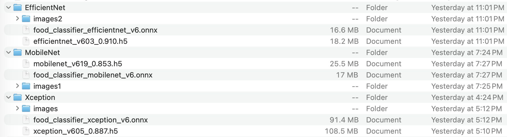

# 🍔 Machine Learning Project Food Image Classification

[Capstone project](https://github.com/DataTalksClub/machine-learning-zoomcamp/tree/master/projects) for DataTalks.Club Machine Learning ZoomCamp 2025. This is a second project I am working on for this course and hope you enjoy it!

## ⚠️ Problem Statement

In today's digital food culture, with the rise of food delivery apps, social media food sharing, and automated restaurant systems, the ability to accurately identify food items from images has become increasingly important. Whether you're a food blogger trying to automatically tag your content, a restaurant implementing automated order verification, or a health-conscious individual tracking dietary intake, manual food identification is time-consuming and prone to human error.

The biggest challenge facing food-related applications is the difficulty of accurate food recognition due to:
- **Visual similarity** between different food categories
- **Preparation variations** within the same food type
- **Lighting and angle differences** in real-world photos
- **Mixed dishes** containing multiple food items
- **Cultural variations** in food presentation

Traditional approaches rely on manual labeling or simple keyword tagging, but in today's AI-driven world, we can leverage deep learning for automated food recognition. Food images vary significantly in presentation, lighting, background, and preparation style, making accurate classification a complex computer vision challenge.

## 🎯 Goal

This project aims to build a food image classification system using the Food-101 dataset (10 categories subset) to automatically identify different food types from photographs with **Transfer Learning**. Transfer Learning is a machine learning technique where a pre-trained model (trained on a large dataset, which is [ImageNet](https://www.image-net.org/) with a total of over 14 million images in its training) is adapted for a new, related task. Instead of training a neural network from scratch, we leverage the knowledge already learned by models trained on massive datasets.


 By leveraging state-of-the-art deep learning models ([Xception](https://keras.io/api/applications/xception/), [MobileNet](https://keras.io/api/applications/mobilenet/), and [EfficientNetB0](https://keras.io/api/applications/efficientnet/#efficientnetb0-function)), we can provide reliable food recognition capabilities for various applications.

**Target Audience**:
- **Food delivery apps** seeking automated order verification systems
- **Health and fitness apps** requiring dietary tracking capabilities  
- **Restaurant technology** implementing automated food recognition for inventory or quality control
- **Food bloggers and social media** looking for automatic content tagging
- **Anyone interested** in computer vision and food classification applications

The ultimate goal is to build a robust image classification model that can accurately identify food categories from real-world photos, enabling automated food recognition in various practical applications.

## 🗄️ Initial Dataset

> [!CAUTION]
> **🚨 Data Processing Disclaimer**
> 
> **The initial 101,000-image dataset [found here](https://data.vision.ee.ethz.ch/cvl/food-101.tar.gz.) is NOT used directly for modeling.**
> 
> This project follows a systematic approach:
> 
> 1. **Data Preparation Phase:** ([EDA_Food.ipynb](https://github.com/eerga/CapstoneMLZoomcamp/blob/main/EDA_Food.ipynb)): Comprehensive analysis of the images, including image quality, size, and brightness, and rotation. The [initial dataset](https://data.vision.ee.ethz.ch/cvl/food-101.tar.gz.) has been converted to a smaller subset of the most popular foods that audience in the United States would choose for lunch or dinner options and consists of 10 food categories and 300 images per food category. The split into train, validation, and test folders is 80%, 10%, and 10%. The final data can be found in [Kaggle](https://www.kaggle.com/datasets/erika7/food-101-small-10-categories-trainvaltest-split/). The data is publically available. 
> 2. **Modeling Phase:** Three models were trained in total for this project: Xception, MobileNet, and EfficientNetB0. Each of the model training and testing phases are located in the respective Jupyter Notebooks (created with Google Colab): for Xception - ([Food_Xception.ipynb](https://github.com/eerga/CapstoneMLZoomcamp/blob/main/Food_Xception.ipynb)), for MobileNet - [Food_MobileNet.ipynb](https://github.com/eerga/CapstoneMLZoomcamp/blob/main/Food_MobileNet.ipynb), for ElasticNetB0 - [FoodElasticNetB0.ipynb](https://github.com/eerga/CapstoneMLZoomcamp/blob/main/Food_ElasticNetB0.ipynb). There was not a specific criteria for selecting models, more just curiousity to see how well each model performs under different circumstances. If you in the future would like to experiment with more models than what's presented here, please refer to [Keras documentation](https://keras.io/api/applications/). All of the models were able to classify the burger image as a burger, so we are going to use the lightest .onnx image. In our case, the model with the lightest image is EfficientNetB0. Advice for the future - use [Kaggle notebooks](https://www.kaggle.com/code) instead of Google Colab to not run into GPU resources limitations. 
> 4. **Final Model Training Phase:** 
and its script equivalent - ([train.py](https://github.com/eerga/MLZoomcampHW/blob/main/midterm_prep/train.py)): Final Model Training and Saving the [Machine Learning Pipeline](https://github.com/eerga/MLZoomcampHW/blob/main/midterm_prep/model.bin) to the `.bin`
> 5. **Pydantic Schema:** ([pydantic_schema.ipynb](https://github.com/eerga/MLZoomcampHW/blob/main/midterm_prep/pydantic_schema.ipynb)): Getting the information to formulate the Schema for Request and Response of the FastAPI application
> 6. **Prediction Model Phase:** ([predict.ipynb](https://github.com/eerga/MLZoomcampHW/blob/main/midterm_prep/predict.ipynb)) and its script equivalent - ([predict.py](https://github.com/eerga/MLZoomcampHW/blob/main/midterm_prep/predict.py)): Loading the model and Serving it via a web service
> 7. **Dependency Files:** [pyproject.toml](https://github.com/eerga/MLZoomcampHW/blob/main/midterm_prep/pyproject.toml)
> 8. **Packaging the Code:** [Dockerfile](https://github.com/eerga/MLZoomcampHW/blob/main/midterm_prep/Dockerfile) for running the service
> 9. **Local Docker Deployment**: See [🐳 Local Docker Deployment](#-local-docker-deployment) section below for local testing instructions
> 10. **Deployment**: See [☁️ Cloud Deployment](#️-cloud-deployment) section with [video demonstration](https://www.youtube.com/watch?v=-sTecFyrV18)
> 
> Only the most relevant features that align with our problem statement will be selected for the final modeling process.
> 
> --------
> 
> **🔍 For the Detail-Oriented:** If you're curious about the nitty-gritty details of the data cleaning and preparation process, dive into [EDA_Food.ipynb](https://github.com/eerga/CapstoneMLZoomcamp/blob/main/EDA_Food.ipynb) for a comprehensive walkthrough.

### 🗄️ Dataset Overview

**Dataset Source**: [Food-101 Original Dataset](https://data.vision.ee.ethz.ch/cvl/food-101.tar.gz)

**Dataset Structure**:
- **Total Images**: 101,000 images (1,000 per category)
- **Food Categories**: 101 different food types from around the world
- **Data Split**: No predefined split (requires manual splitting)
- **Image Format**: RGB color images (.jpg)
- **Input Size**: Varies (typically 512x512)

**Target Variable**: **🍽️ Food Category** - Multi-class classification with 101 food categories

**Food Categories Include**:
<details>
<summary><strong>🌍 Complete List of 101 Food Categories</strong> (Click to expand)</summary>

1. `apple_pie` - Traditional apple dessert
2. `baby_back_ribs` - Barbecue pork ribs
3. `baklava` - Middle Eastern pastry
4. `beef_carpaccio` - Thinly sliced raw beef
5. `beef_tartare` - Raw ground beef dish
6. `beet_salad` - Fresh beetroot salad
7. `beignets` - French pastry donuts
8. `bibimbap` - Korean mixed rice dish
9. `bread_pudding` - Sweet bread dessert
10. `breakfast_burrito` - Mexican-style wrap
11. `bruschetta` - Italian toasted bread
12. `caesar_salad` - Roman lettuce salad
13. `cannoli` - Italian pastry tubes
14. `caprese_salad` - Italian tomato mozzarella salad
15. `carrot_cake` - Spiced cake with carrots
16. `ceviche` - Latin American seafood dish
17. `cheese_plate` - Assorted cheese selection
18. `cheesecake` - Creamy dessert cake
19. `chicken_curry` - Spiced chicken dish
20. `chicken_quesadilla` - Mexican grilled tortilla
21. `chicken_wings` - Buffalo wings and variations
22. `chocolate_cake` - Rich chocolate dessert
23. `chocolate_mousse` - Light chocolate dessert
24. `churros` - Spanish fried pastry
25. `clam_chowder` - Creamy seafood soup
26. `club_sandwich` - Multi-layer sandwich
27. `crab_cakes` - Seasoned crab patties
28. `creme_brulee` - French custard dessert
29. `croque_madame` - French grilled sandwich
30. `cup_cakes` - Individual portion cakes
31. `deviled_eggs` - Seasoned egg appetizer
32. `donuts` - Sweet fried pastries
33. `dumplings` - Filled dough parcels
34. `edamame` - Boiled soybeans
35. `eggs_benedict` - Poached eggs dish
36. `escargots` - French snails
37. `falafel` - Middle Eastern chickpea balls
38. `filet_mignon` - Premium beef cut
39. `fish_and_chips` - British fried fish
40. `foie_gras` - French duck liver
41. `french_fries` - Deep-fried potato strips
42. `french_onion_soup` - Onion soup with cheese
43. `french_toast` - Sweet bread breakfast
44. `fried_calamari` - Fried squid rings
45. `fried_rice` - Asian stir-fried rice
46. `frozen_yogurt` - Chilled yogurt dessert
47. `garlic_bread` - Herb-seasoned bread
48. `gnocchi` - Italian potato dumplings
49. `greek_salad` - Mediterranean salad
50. `grilled_cheese_sandwich` - Melted cheese sandwich
51. `grilled_salmon` - Cooked salmon fillet
52. `guacamole` - Mexican avocado dip
53. `gyoza` - Japanese pan-fried dumplings
54. `hamburger` - Ground beef sandwich
55. `hot_and_sour_soup` - Spicy Chinese soup
56. `hot_dog` - Grilled sausage sandwich
57. `huevos_rancheros` - Mexican egg dish
58. `hummus` - Middle Eastern chickpea dip
59. `ice_cream` - Frozen dairy dessert
60. `lasagna` - Italian layered pasta
61. `lobster_bisque` - Rich seafood soup
62. `lobster_roll_sandwich` - Maine-style sandwich
63. `macaroni_and_cheese` - Cheese pasta dish
64. `macarons` - French sandwich cookies
65. `miso_soup` - Japanese soybean soup
66. `mussels` - Shellfish dish
67. `nachos` - Mexican tortilla chips
68. `omelette` - Folded egg dish
69. `onion_rings` - Battered fried onions
70. `oysters` - Raw/cooked shellfish
71. `pad_thai` - Thai stir-fried noodles
72. `paella` - Spanish rice dish
73. `pancakes` - Flat breakfast cakes
74. `panna_cotta` - Italian dessert
75. `peking_duck` - Chinese roasted duck
76. `pho` - Vietnamese noodle soup
77. `pizza` - Italian flatbread
78. `pork_chop` - Grilled pork cut
79. `poutine` - Canadian fries with gravy
80. `prime_rib` - Premium beef roast
81. `pulled_pork_sandwich` - Slow-cooked pork
82. `ramen` - Japanese noodle soup
83. `ravioli` - Italian stuffed pasta
84. `red_velvet_cake` - Colored layer cake
85. `risotto` - Italian rice dish
86. `samosa` - Indian fried pastry
87. `sashimi` - Japanese raw fish
88. `scallops` - Pan-seared shellfish
89. `seaweed_salad` - Japanese wakame salad
90. `shrimp_and_grits` - Southern comfort food
91. `spaghetti_bolognese` - Italian meat sauce pasta
92. `spaghetti_carbonara` - Italian cream sauce pasta
93. `spring_rolls` - Asian wrapped appetizers
94. `steak` - Grilled/cooked beef
95. `strawberry_shortcake` - Berry dessert
96. `sushi` - Japanese rice and fish
97. `tacos` - Mexican folded tortillas
98. `takoyaki` - Japanese octopus balls
99. `tiramisu` - Italian coffee dessert
100. `tuna_tartare` - Raw tuna dish
101. `waffles` - Grid-patterned breakfast cake

</details>

**Input Features (Raw Images)**:
- **Image Pixels**: RGB pixel values (512×512×3 = 786,432 features before preprocessing)
- **Spatial Information**: Position and arrangement of visual food elements
- **Color Information**: RGB channels capturing food appearance, cooking level, ingredients
- **Texture Patterns**: Surface characteristics like crispy, creamy, grilled, fried textures
- **Shape and Structure**: Geometric features and food presentation styles
- **Contextual Elements**: Plates, utensils, garnishes, and serving presentations

**Data Preprocessing Requirements**:
- **Image Resizing**: Standardize to 150x150 for initial training stages and to 299×299 pixels for the final model input after the best smaller model has been determined. 
- **Normalization**: Pixel values scaled to [-1,1] range
- **Data Augmentation**: Rotation, horizontal flip, zoom, brightness adjustments
- **Train/Val/Test Split**: Manual splitting required (80/10/10)
- **Format Standardization**: Convert all images to RGB format

**Dataset Characteristics**:
```
Total Images:     101,000 images
Categories:       101 food types
Images per class: 1,000 images
File Format:      .jpg (RGB)
Average size:     ~512x512 pixels
Total size:       ~5.3 GB compressed
```

### 📊 Dataset Challenges

**Visual Complexity**:
- **Intra-class Variation**: Same food prepared differently (e.g., pizza with different toppings)
- **Inter-class Similarity**: Similar looking foods (e.g., different types of pasta)
- **Presentation Variety**: Restaurant vs. homemade vs. street food presentations
- **Cultural Variations**: Same dish prepared in different cultural styles

**Technical Challenges**:
- **Lighting Conditions**: Professional food photography vs. casual snapshots
- **Background Noise**: Different plates, tables, and serving environments
- **Image Quality**: Varying resolution and focus quality across images
- **Class Imbalance**: While balanced by design, real-world applications face imbalanced data

### 📊 EDA

The distribution of the images shows a balanced dataframe, indicating that misclassification would be less likely to occur.  


*Representative samples from Food-101 dataset showing diversity in food presentation and styling*

<br>

## 🧹 Subset Data
### 🗄️ Dataset Overview

**Dataset Source**: [Food-101 Small (10 Categories)](https://www.kaggle.com/datasets/erika7/food-101-small-10-categories-trainvaltest-split/)

**Dataset Structure**:
- **Total Images**: 3,000 images (300 per category)
- **Food Categories**: 10 popular food types
- **Data Split**: 80% Train (240 images for each of the 10 categories) / 10% Validation (30 images for each of the 10 categories) / 10% Test (0 images for each of the 10 categories)
- **Image Format**: RGB color images
- **Input Size**: Varies (resized to 224x224 for model training)

**Target Variable**: **🍽️ Food Category** - Multi-class classification with 10 food categories

**Food Categories**:
<details>
<summary><strong>🌍 Complete List of 10 Food Categories</strong> (Click to expand)</summary>
1. `apple_pie` - Traditional apple dessert
2. `burger` - Hamburger/cheeseburger
3. `chicken_wings` - Buffalo wings and variations
4. `fried_rice` - Asian fried rice dishes
5. `ice_cream` - Ice cream and frozen desserts
6. `pizza` - Pizza varieties
7. `ramen` - Japanese noodle soup
8. `steak` - Grilled/cooked beef steak
9. `sushi` - Japanese sushi and rolls
10. `tacos` - Mexican tacos and variations
</details>

**Input Features**:
- **Image Pixels**: RGB pixel values (512x512x3 = 786,432 features before preprocessing)
- **Spatial Information**: Position and arrangement of visual elements
- **Color Information**: RGB color channels capturing food appearance
- **Texture Patterns**: Surface characteristics and visual textures
- **Shape and Structure**: Geometric features and food presentation

**Data Preprocessing**:
- **Image Resizing**: All images resized to 224×224 pixels
- **Normalization**: Pixel values normalized to [-1,1] range
- **Data Augmentation**: Random rotations, flips, and brightness adjustments during training
- **Format Standardization**: All images converted to RGB format

**Dataset Statistics**:
```
Train Set:      2,400 images (240 per category)
Validation Set:   300 images (30 per category)  
Test Set:         300 images (30 per category)
```

## 📊 Data Distribution


*Balanced distribution across all 10 food categories*


*Representative samples from each food category showing variety in presentation, lighting, and style*

The pizza image has 382 x 512 dimensions
The sushi image has 512 x 512 dimensions
The pad thai image has 512 x 512 dimensions

It is possible to observe that some images have a much better quality compared to others. It is also possible to see that the food is not perfectly centered at the table. Moreover, there is some background "noise" present in the form of the human hand in case of the pizza picture. 

## 🤖 Model training

**Pre-trained Models Foundation**: Our models (Xception, MobileNet, EfficientNetB0) were initially trained on **ImageNet** - a dataset containing 14+ million images across 1,000 categories including many food items, animals, objects, and scenes.

**What the Models Already Know**:
- **Low-level features**: Edges, shapes, colors, textures
- **Mid-level features**: Food textures (crispy, creamy, grilled), geometric patterns
- **High-level features**: Object recognition, spatial relationships

### Our Transfer Learning Strategy

```python
# 1. Load pre-trained model (frozen weights)
base_model = EfficientNetB0(
    weights='imagenet',        # Pre-trained ImageNet weights
    include_top=False,         # Remove original classification head
    input_shape=(224, 224, 3)  # Food image input size
)

# 2. Freeze pre-trained layers (keep learned features)
base_model.trainable = False

# 3. Add custom classification head for our 10 food categories
model = Sequential([
    base_model,                           # Pre-trained feature extractor
    GlobalAveragePooling2D(),            # Reduce spatial dimensions
    Dense(100, activation='relu'),        # Custom dense layer
    Dropout(0.2),                        # Prevent overfitting
    Dense(10, activation='softmax')       # 10 food categories output
])
```

### Benefits for Our Food Classification:

1. **Faster Training**: No need to learn basic visual features from scratch
2. **Better Performance**: Leverages millions of pre-learned visual patterns
3. **Less Data Required**: Effective with our 3,000 food images vs millions needed for training from scratch
4. **Reduced Overfitting**: Pre-trained weights provide good starting point

### Two-Stage Training Process:

**Stage 1: Feature Extraction**
- Freeze pre-trained layers (base_model.trainable = False)
- Only train the new classification head
- Learn food-specific classification patterns

**Stage 2: Fine-tuning** (Optional)
- Unfreeze top layers of pre-trained model
- Very slow learning rate to avoid destroying pre-learned features
- Fine-tune features specifically for food recognition

This approach allows us to achieve **91.0% accuracy** on food classification by building upon years of computer vision research encoded in pre-trained models.



**Models Evaluated**:
- **Xception**: Transfer learning with pre-trained ImageNet weights
- **MobileNet**: Lightweight architecture optimized for mobile deployment  
- **EfficientNetB0**: Balanced accuracy and efficiency

**Performance Metrics**:
```
Model           | Val Accuracy | Val Loss | Model Size | ONNX Model Size
----------------|--------------|----------|------------|-----------------
Xception        | 87.7%        | 0.435    | 108.5 MB   | 91.4 MB
MobileNet       | 85.3%        | 0.574    | 25.5 MB    | 17 MB
EfficientNetB0  | 91.0%        | 0.305    | 18.2 MB    | 16.6 MB
```

### 🎯 Model Selection Criteria

**EfficientNetB0** was selected as the final model based on:
- **Highest Validation accuracy**: 91.0%
- **Lowest validation loss**: 0.305
- **Reasonable model size**: 16.6 MB (good for deployment)
- **Stable training**: Minimal overfitting observed

### 📈 Training Performance

*Training and validation accuracy/loss curves showing stable convergence*

### 🎯 Best Model Architecture


**EfficientNetB0 Configuration**:
```python
Base Model: EfficientNetB0 (pre-trained on ImageNet)
Input Shape: (224, 224, 3)
Trainable Parameters: 4,049,571
Non-trainable Parameters: 1,000,000
Total Parameters: 5,049,571

Custom Classification Head:
- Global Average Pooling
- Dense(128, activation='relu')
- Dropout(0.5)
- Dense(10, activation='softmax')
```

Again, this project is not focused on having the absolute best model. We are doing everything we can. 


`ElasticNet` was the model of my selection with the listed parameters. 

### 🐳 Local Docker Deployment

> [!NOTE]
> **Video Demonstration Available**: Complete walkthrough of local Docker deployment and testing. Click [here to watch the video demonstration](youtube.com/watch?v=Uaqv5nxVsjs&feature=youtu.be) or follow the step-by-step instructions below.

> [!TIP]
> **Prerequisites**: Ensure Docker is installed and running on your machine

📥 **Step 1: Get the Code**

Clone the repository
```bash
# Clone the repository
git clone https://github.com/eerga/CapstoneMLZoomcamp.git

✅ **Step 2: Verify Docker Installation**

```sh
docker run hello-world
```

> [!NOTE] 
> If the above command runs successfully, you're ready to proceed!

🔨 **Step 3: Build the Docker Image**
```sh
# Build the prediction API image
docker build --no-cache -t real-estate-prediction .
```

🚀 **Step 4: Run the Container**
```sh
# Start the API server
docker run -it --rm -p 9696:9696 real-estate-prediction
```

🧪 Step 5: Test Your API
🌐 Open your browser and navigate to: http://localhost:9696/docs
📄 Click "Try it out" in the FastAPI documentation interface
📋 Copy and paste the content from [re_property.json](https://github.com/eerga/MLZoomcampHW/blob/main/midterm_prep/re_property.json)
▶️ Click "Execute" to get your prediction
Expected reponse:

```python
{
  "predicted_value": 807383.14
}
```

**Option B: Automated Testing Script**

```python 
cd MLZoomcampHW/midterm_prep
python marketing.py
```
🧹 **Step 6: Clean Up**

```sh
# Optional: Remove the image to free up space
docker rmi real-estate-prediction
```

>[!WARNING] Port Conflicts: If port 9696 is already in use, try: docker run -it --rm -p 9697:9696 real-estate-prediction and access via http://localhost:9697

### ☁️ AWS Serverless deployment

> [!NOTE]
> **Video Proof Available**: This deployment was successfully completed and documented. No need to run these commands yourself! Click on the [video proof](https://www.youtube.com/watch?v=-sTecFyrV18) to see the deployment video.

🚀 **Step 1: Install AWS CLI**

- [AWS Account](https://mlbookcamp.com/article/aws)
- [AWS Cli](https://docs.aws.amazon.com/cli/latest/userguide/getting-started-install.html)

```bash
# Download and install Fly.io CLI
curl -L https://fly.io/install.sh | sh
```

⚙️ **Step 2: Edit shell configuration (works for Mac)**

Open the bash shell
```sh
nano ~/.zshrc
```
Export environment variables 
```sh
export FLYCTL_INSTALL="{directory}/.fly"
export PATH="$FLYCTL_INSTALL/bin:$PATH"
```
Reload the shell to update its status:

```sh
`source ~/.zshrc
```
✅ **Step 3: Verify Installation**
```sh
which fly
```

🔐 **Step 4: Authentication & Setup**
```sh
# Sign up and authenticate with Fly.io
fly auth signup
```

```sh
# Launch your app with auto-generated name
fly launch --generate-name
```

>[!TIP] 
> **Interactive Setup Questions**:
> ❌ N - No, I don't want to tweak the settings
> ✅ Y - Yes, create a Dockerfile

🚀 **Step 5: Deploy Your Application**
Check that Docker ignore was created

```fly deploy```

🎯 **Step 6: Test Your Deployment**
1. 📋 Get your deployment URL from the fly deploy output
2. 🌐 Navigate to [your-app-url]/docs
3. 🧪 Click "Try it out" in the FastAPI documentation
4. 📄 Copy-paste your re_property.json test data
5. 🎉 Expected Response:
```python
{
  "predicted_value": 807383.14
}
```
🧪 **Step 7: Test with Custom Script**
```python
# Update marketing.py with your deployment URL
python marketing.py
```

🧹 **Step 8: Clean Up (Optional)**

```sh
# List all your fly apps
fly apps list
```

Destroy the app
```sh
fly apps destroy <app-name>
```
